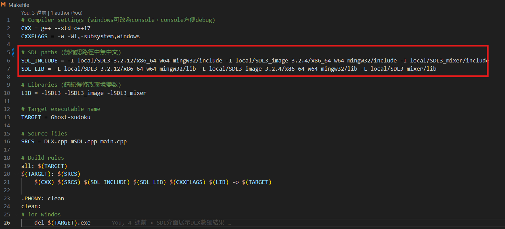
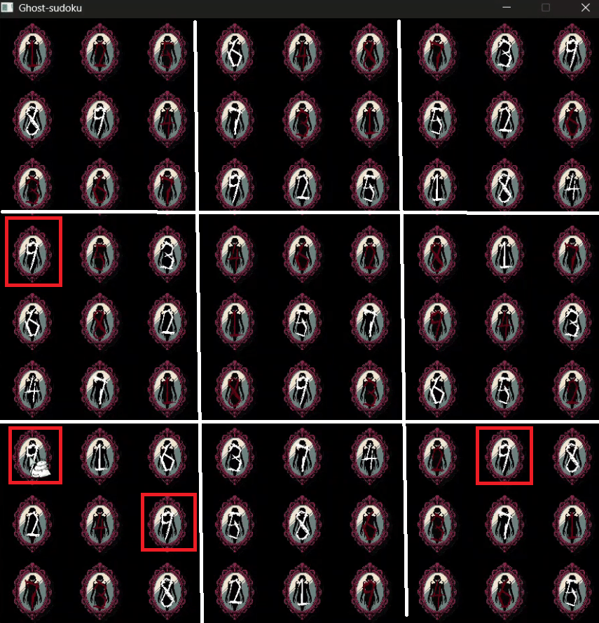
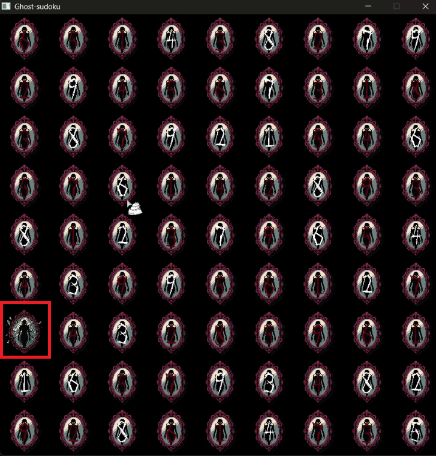
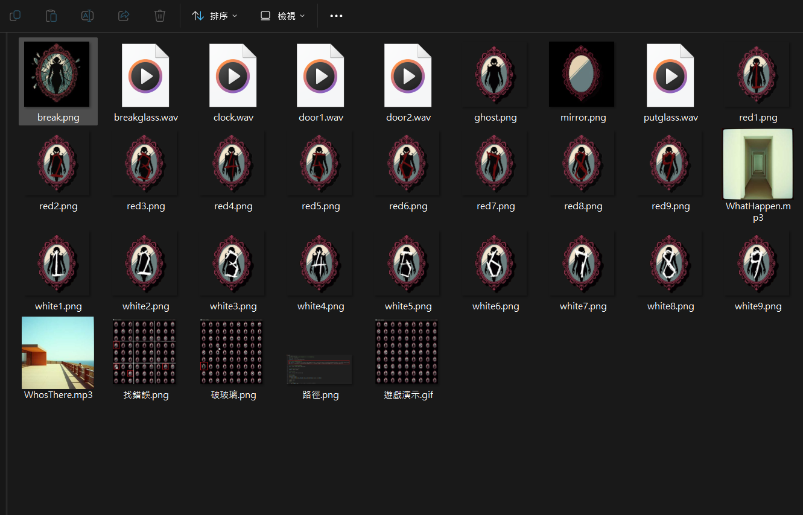

# **Ghost-Sudoku**
### 數獨除錯小遊戲~  

## 安裝說明

本次實作環境：
* Windows 11
* g++ 13.2.0 (Built by MinGW-Builds project)
* Visual Studio Code (version 1.100)
* SDL-3.2.12, SDL_image-3.2.4, SDL_mixer ( git hash : daf0503 )  

在安裝前請先下載SDL3函式庫：
* [SDL](https://github.com/libsdl-org/SDL)
* [SDL_image](https://github.com/libsdl-org/SDL_image)
* [SDL_mixer](https://github.com/libsdl-org/SDL_mixer)    

並更改[Makefile](./Makefile)內的路徑

  

## 遊戲設計
**數獨是個十分困難的遊戲，對於人們的腦力與眼力都是一大挑戰！假如今天你不小心填錯了一個數字，你能從茫茫「數」海中尋到他的身影嗎？**
### 隨機生成錯誤數獨  
> 在面板中選幾個格子填入隨機數字，然後再用DLX演算法解數獨以達成隨機生成數獨面板。在正確的面板中插入一個錯誤，考驗玩家的耐心和眼力。

### 左鍵點擊驅散鬼魂
> 根據數獨規則，每一直排、橫排、九宮格內不能有重複的數字，上圖中我滑鼠所指的便是一個錯誤。對著錯誤點擊左鍵會擊碎鏡子並刷新數獨面板。

### AI生成、圖片與音效
> Claude協助除錯、Ideogram生成像素鏡子、Suno生成背景音樂，搭配網路上免費的音效素材和字型，成就整體遊戲性。目前有兩首輪流播放的背景音樂、三種在過程中隨機觸發的恐怖音效，增添遊戲氛圍感。

## 參考資料
* **遊戲素材與DLX部分程式由AI生成，有關DLX的部分：**[github](https://github.com/dreamskyo/DLX-sudoku)
1.	[Dancing Links Wiki](https://en.wikipedia.org/wiki/Dancing_Links#Exploring)
2.	[Stackoverflow - The Dancing Links Algorithm - An explanation that is less explanatory but more on implementation?](https://stackoverflow.com/questions/1518335/the-dancing-links-algorithm-an-explanation-that-is-less-explanatory-but-more-o)
3.	[arXiv - Donald E. Knuth Dancing links](https://arxiv.org/abs/cs/0011047)
4.	[SDL3 Wiki](https://wiki.libsdl.org/SDL3/FrontPage)
5.	[SDL3 Tutorial - Lazy Foo' Productions](https://lazyfoo.net/tutorials/SDL3/index.php)

